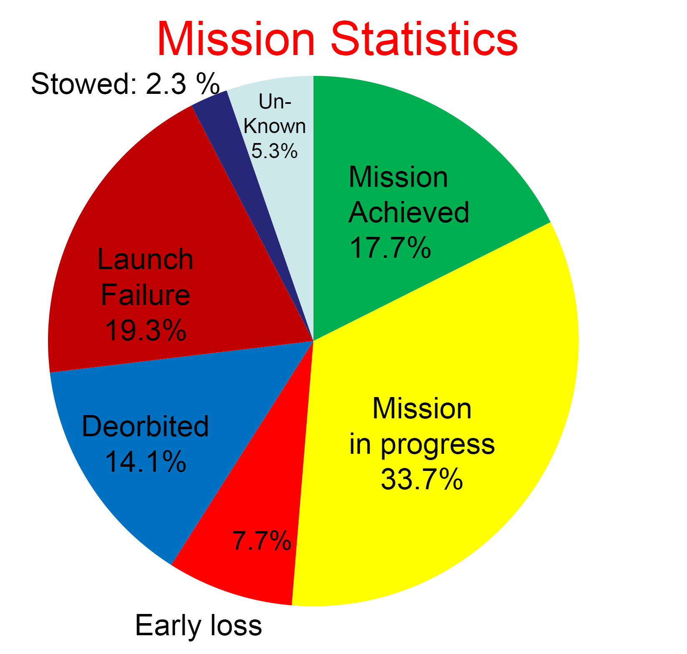
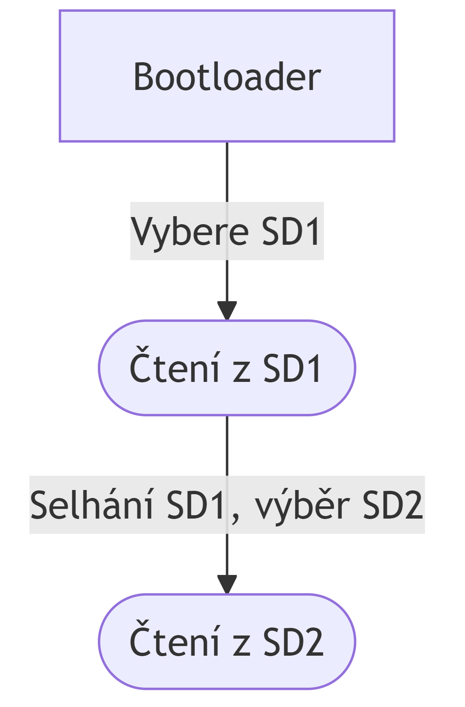
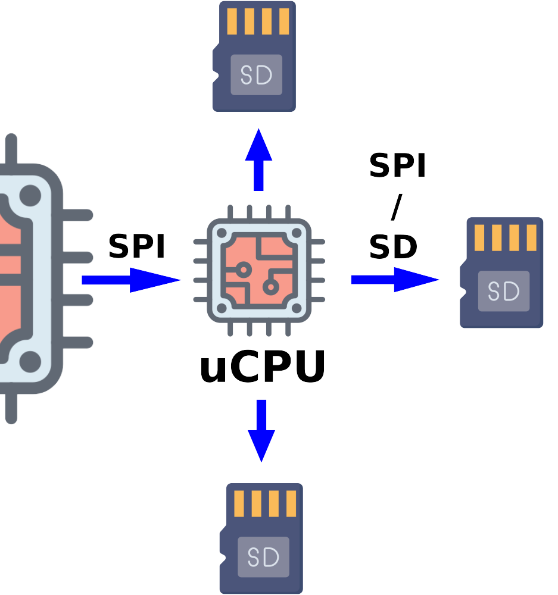
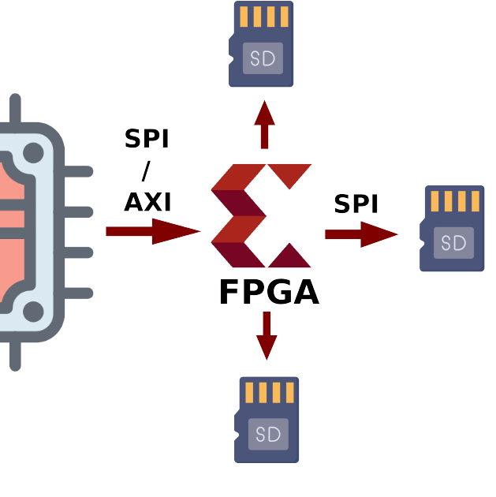
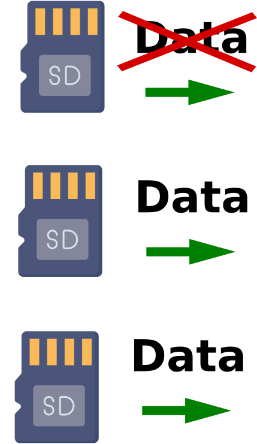

# Redundantní uložiště pro CubeSat
## Návrh praktického řešení

   

Téma: Magisterská práce
Datum: 16. 2. 2025
Autor: Jaroslav Körner
Vedoucí práce: Ing. Lenka Kosková Třísková, Ph.D.

---
## Zadání: 
### Realizace úložiště souborového systému Linux odolného proti poruchám určeného pro CubeSat

Cíle práce:
1. Seznámit se s problematikou malých satelitů - CubeSat.
2. Navrhnout řešení vhodné pro malý satelit na LEO.
3. Provést analýzu FMECA daného řešení.
4. Implementovat a otestovat řešení na demonstračním HW s OS Linux.

---
## Problém: 
### CubeSatů obecně

- Okolo 50% misí skončí neúspěchem.
- Až 20% selhání nastane po vynesení na oběžnou dráhu.
  - Selhání elektroniky je nejčastější příčinou.

---
## Problém: 
### úložiště satelitu
Jedno SD/MMC uložiště není dostatečně spolehlivé pro misi CubeSatu.

### Stávající řešení (VZLUSAT-2):
- 2 SD/MMC uložiště
- Modifikovaný Bootloader

---
## Myšlenka

- Nahrazení 2 SD karty za 3 SD karty.
- Vytvoření rozhraní řadiče
  - Ten zprostředkovává přístup k uložišti, jako by to byla jedna karta.
- Implemetnace algoritmu odolného proti chybám čtení poškozených dat.

---
## Možná řešení:

- Softwarové řešení
  - Přidání uCPU a vytvoření SW pro ovládání SD karet
- Hardwarové řešení
  - Vytvoření IP jádra pro FPGA

  
  

---
## SW řešení
- Softwarové řešení
- uCPU
  - SPI / SD
- Rozhraní:
  - SPI slave

---
## HW řešení (IP core)

- IP jádro pro FPGA
- FPGA
  - PMOD - na SD
- Rozhraní:
  - AXI-MM / SPI slave

---
## Algoritmus:
- Při poškození dat -> majority vote
- Při poškození 1 karty -> přestane z ní číst a odešle data pokud jsou shodná na obou kartách
- Při poškození 2 karet -> přestane z nich číst a odešle data z jedné karty 

---
## Analýza FMECA

TODO...

---
## Demonstrace na HW

TODO...

---
## Dekuji za pozornost

---
## Zdroje:
- [Statistiky misí: Otto F. Koudelka - Nanosatellites for Technological and Science Missions]()
